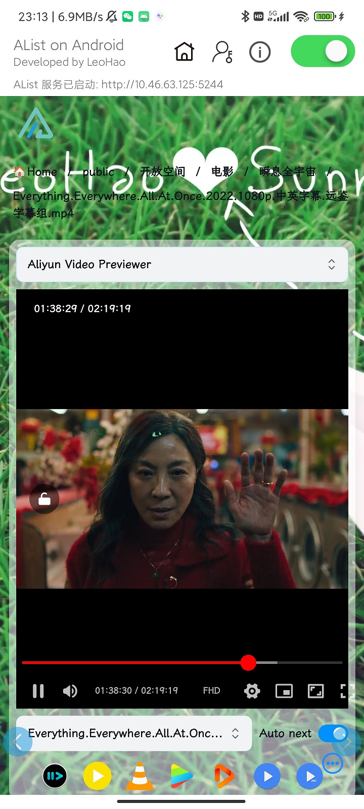
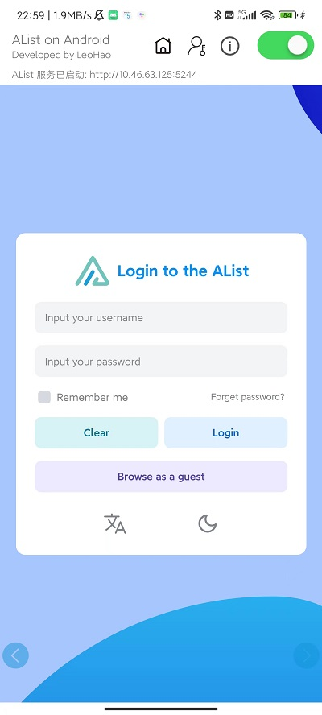
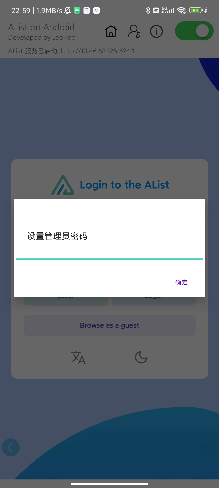
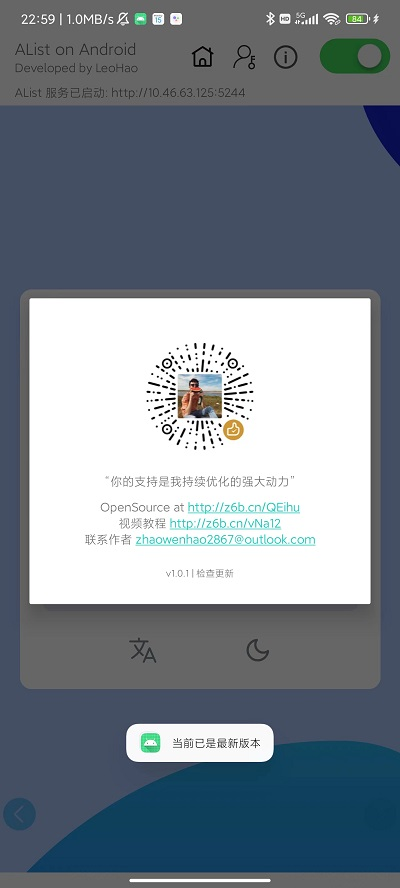
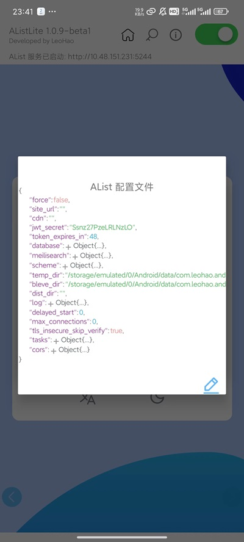

<h3 align="center">AListLite | 无需配置即可在 Android 上运行 AList 服务</h3>

  
  
 

# AListLite

[AListLite](https://github.com/LeoHaoVIP/AListLiteAndroid) 是一款支持运行 AList 服务的 Android 应用，相对于教程 [BV1ex4y157xJ](https://www.bilibili.com/video/BV1ex4y157xJ) 中的描述，用户无需借助安装 Termux 即可实现在 Android 设备（手机/电视）上使用 AList 服务。

[AListLite](https://github.com/LeoHaoVIP/AListLiteAndroid) 支持服务一键启动、后台常驻和版本更新等功能，界面简洁，上手简单。

## Compatibility

[AListLite](https://github.com/LeoHaoVIP/AListLiteAndroid) 集成了 Golang 实现的 [AList](https://github.com/alist-org/alist)，适配 `x86_64`、`x86`、`arm64-v8a`、`armeabi-v7a` CPU 架构，可运行在主流 Android 版本上（最低支持 Android 5.0 版本 | SDK API 21），同时适配移动设备和 TV 设备。

## User Manual

### 安装

下载 [app-release.apk](https://github.com/LeoHaoVIP/AListLiteAndroid/releases/latest) 并安装在 Android 设备上，启动后授予必要权限。

### 启动服务

> 服务启动完成后，建议在 PC 端访问服务地址进行后续的 AList 配置

点击右上角开关，开启或停止 AList 服务。服务启动成功后将显示 AList 前端页面，同时在上方标识当前绑定的 IP 地址和端口。

### 修改管理员密码

点击  按钮，设定管理员密码后使用 admin 账户登录。

### 返回到主页面

点击  按钮，从当前页立即切换到主页。

### WebView 操作

为便于用户使用，用户可通过点击主页面左右两侧的  和  按钮实现页面前进与后退。

# Update

新版本将发布在 [GitHub Release](https://github.com/LeoHaoVIP/AListLiteAndroid/releases/latest)。对于已安装 APP 的用户，点击标题栏中 按钮，在版本信息页面点击下方“检查更新”即可获取最新版本。

# Advanced

为最大程度匹配 AList 本身的能力，AListLite 支持用户手动修改 AList 配置文件，文件位置为 `/Android/data/com.leohao.android.alistlite/files/data/config.json`，配置修改入口为版本信息页面下方的`高级配置`。

> 注意：错误的配置可能导致服务无法启动，请谨慎操作！

# Support

Email: <zhaowenhao2867@outlook.com>

Bilibili: [AListLite | 一款支持运行 AList 服务的 Android 应用](https://www.bilibili.com/video/BV1PA4m1G7Ui)
