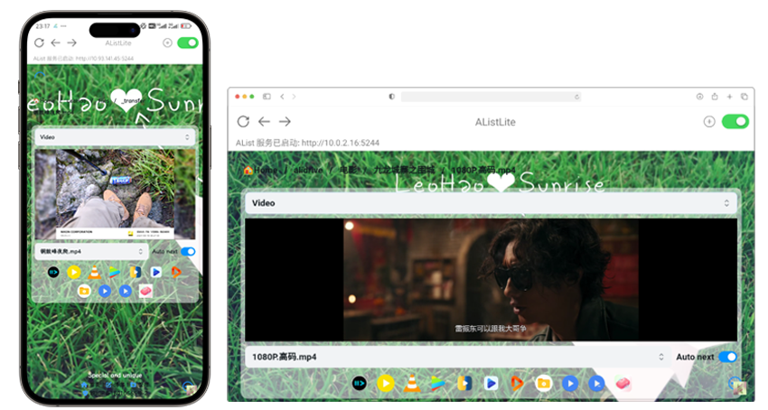
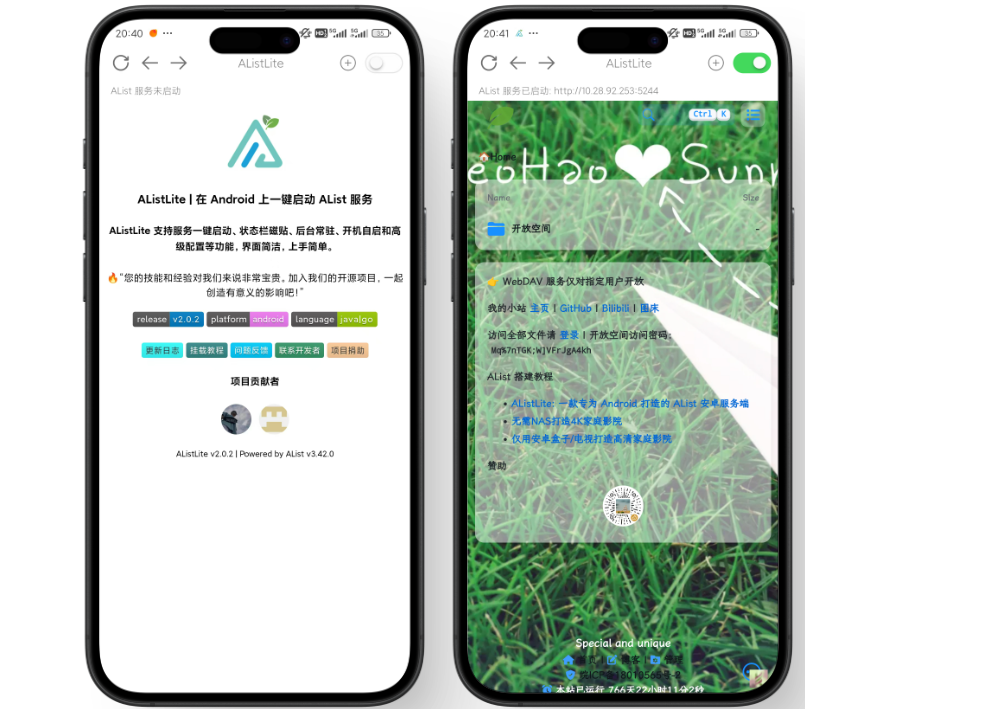
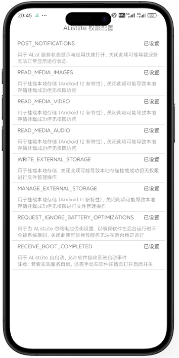
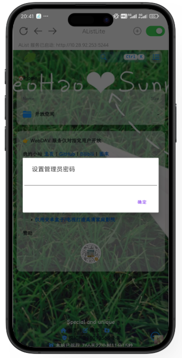
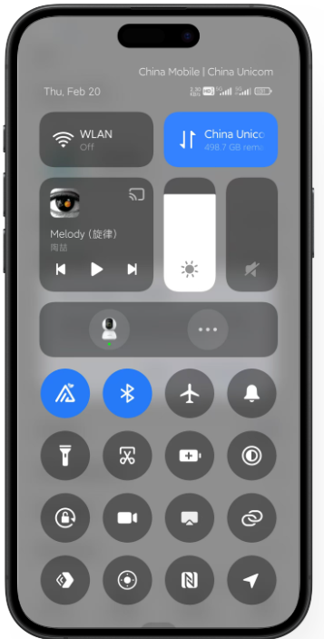
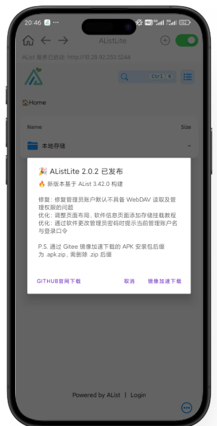
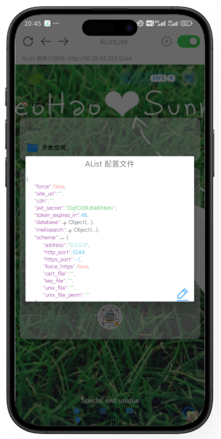

<h3 align="center">AListLite | 在 Android 上一键启动 AList 服务</h3>
<h5 align="center">AListLite 支持服务一键启动、状态栏磁贴、后台常驻、开机自启和高级配置等功能，界面简洁，上手简单。</h5>

    
    
    

    
    
    

# AListLite

[AListLite](https://github.com/LeoHaoVIP/AListLiteAndroid) 是一款支持运行 AList 服务的 Android 应用，相对于教程 [BV1ex4y157xJ](https://www.bilibili.com/video/BV1ex4y157xJ) 中的描述，用户无需借助安装 Termux 即可实现在 Android 设备（手机/电视）上使用 AList 服务。

[AListLite](https://github.com/LeoHaoVIP/AListLiteAndroid) 支持服务一键启动、状态栏磁贴、后台常驻、开机自启和高级配置等功能，界面简洁，上手简单。

<h5 align="center">Buy Me a Coffee!</h5>

## Compatibility

[AListLite](https://github.com/LeoHaoVIP/AListLiteAndroid) 集成了 Golang 实现的 [AList](https://github.com/alist-org/alist)，适配 `x86_64`、`x86`、`arm64-v8a`、`armeabi-v7a` CPU 架构，可运行在主流 Android 版本上（最低支持 Android 5.0 版本 | SDK API 21），同时适配移动设备和 TV 设备。

## User Manual

### 安装

| 发布平台 | 发布地址                                                     | 备注         |
| -------- | ------------------------------------------------------------ | ------------ |
| GitHub   | https://github.com/LeoHaoVIP/AListLiteAndroid/releases/latest |              |
| Gitte    | https://gitee.com/leohaovip/AListLiteAndroid/releases/latest |              |
| 天翼云盘 | https://cloud.189.cn/t/VfYNZrqYrMzq                          | 访问码：jc08 |

### 启动服务

> ① 服务启动完成后，建议在 PC 端访问服务地址进行后续的 AList 配置
>
> ② 设备本地请访问 http://localhost:5244

点击右上角开关，开启或停止 AList 服务。服务启动成功后将显示 AList 前端页面，同时在上方标识当前绑定的 IP 地址与端口。

### 授予权限

> **开机自启说明**
>
> 若要实现 AList 服务开机自启，授予相关权限外，还需要在系统设置中手动开启 APP 的自启动开关。

首次打开 APP 后，软件将申请必要的存储、通知与后台运行权限，权限授予情况可点击软件右上角 `+` 号，进入 `权限配置` 页面查看。

### 修改管理员密码

点击软件右上角 `+` 号，选择 `密码设置` 可修改管理员密码，默认登录信息为 `admin` + `123456`。

### 状态栏磁贴

Android N（7.0）及以上版本可在控制栏设置 AListLite 快速启停磁贴，实现无需打开软件，即可快速开启或关闭 AList 服务。

# Update

对于已安装 APP 的用户，软件每次开启时将自动检查更新，用户也可点击软件右上角 `+` 号，选择下方 `检查更新` 手动获取新版本发布情况。

# Advanced

为最大程度匹配 AList 本身的能力，AListLite 支持用户手动修改 AList 配置文件。用户可点击软件右上角 `+` 号，选择 `高级配置` 修改配置文件，实现自定义端口、HTTPS、数据库配置等个性化需求。

> 注意：错误的配置可能导致服务无法启动，请谨慎操作！

# Support

Email: <zhaowenhao2867@outlook.com>

Bilibili: [AListLite | 一款支持运行 AList 服务的 Android 应用](https://www.bilibili.com/video/BV1PA4m1G7Ui)

